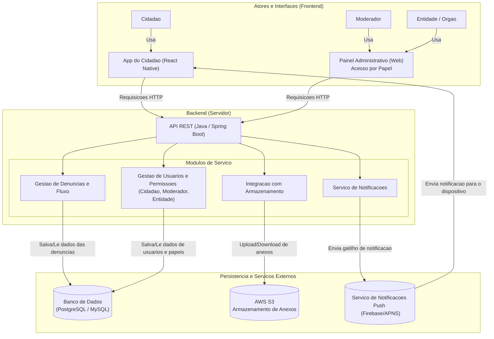

```mermaid
graph TD
    subgraph "Atores e Interfaces (Frontend)"
        A["Cidadao"] -- "Usa" --> AppCidadao["App do Cidadao (React Native)"]
        B["Moderador"] -- "Usa" --> PainelAdmin["Painel Administrativo (Web) <br> Acesso por Papel"]
        D["Entidade / Orgao"] -- "Usa" --> PainelAdmin
    end

    subgraph "Backend (Servidor)"
        API["API REST (Java / Spring Boot)"]
        
        subgraph "Modulos de Servico"
            S1["Gestao de Denuncias e Fluxo"]
            S2["Gestao de Usuarios e Permissoes <br> (Cidadao, Moderador, Entidade)"]
            S3["Servico de Notificacoes"]
            S4["Integracao com Armazenamento"]
        end
    end

    subgraph "Persistencia e Servicos Externos"
        DB[("Banco de Dados <br> (PostgreSQL / MySQL)")]
        S3Bucket[("AWS S3 <br> Armazenamento de Anexos")]
        PushService[("Servico de Notificacoes Push <br> (Firebase/APNS)")]
    end

    %% Conexoes
    AppCidadao -- "Requisicoes HTTP" --> API
    PainelAdmin -- "Requisicoes HTTP" --> API

    API --> S1 & S2 & S3 & S4

    S1 -- "Salva/Le dados das denuncias" ---> DB
    S2 -- "Salva/Le dados de usuarios e papeis" ---> DB
    
    S4 -- "Upload/Download de anexos" ---> S3Bucket
    
    S3 -- "Envia gatilho de notificacao" ---> PushService

    PushService -- "Envia notificacao para o dispositivo" --> AppCidadao
```
