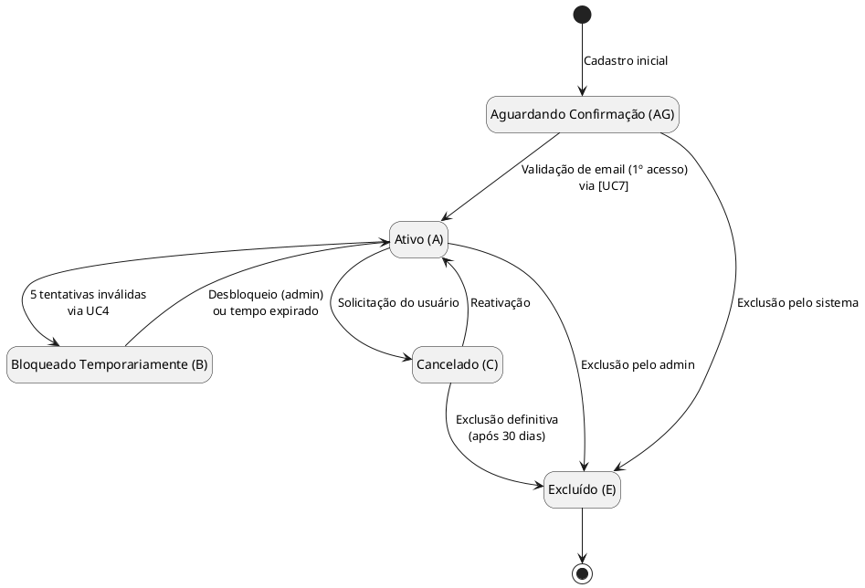

# Status do Usuário

```plantuml
@startuml
hide empty description
state "Aguardando Confirmação (AG)" as AG
state "Ativo (A)" as A
state "Bloqueado Temporariamente (B)" as B
state "Cancelado (C)" as C
state "Excluído (E)" as E

[*] --> AG : Cadastro inicial
AG --> A : Validação de email (1º acesso)\nvia [UC7]
AG --> E : Exclusão pelo sistema

A --> B : 5 tentativas inválidas\nvia UC4
B --> A : Desbloqueio (admin)\nou tempo expirado

A --> C : Solicitação do usuário
C --> A : Reativação
C --> E : Exclusão definitiva\n(após 30 dias)

A --> E : Exclusão pelo admin

E --> [*]

@enduml

```
