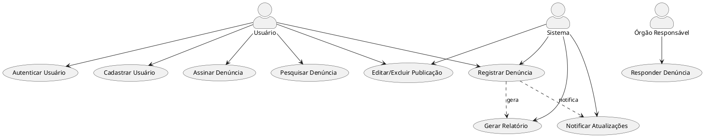

# 1. 🎯 Caso de Uso: Reclama.se
- [1. 🎯 Caso de Uso: Reclama.se](#1--caso-de-uso-reclama.se)
	- [1.1. Identificação](#11-identificação)
	- [1.2. Visão Geral](#12-visão-geral)
	- [1.3. Fluxo Principal de Eventos](#13-fluxo-principal-de-eventos)
	- [1.4. Fluxos Alternativos](#14-fluxos-alternativos)
		- [1.4.1. a. Credenciais Inválidas](#141-a-credenciais-inválidas)
		- [1.4.2. b. Primeiro Acesso](#142-b-primeiro-acesso)
	- [1.5. Fluxos de Exceção](#15-fluxos-de-exceção)
		- [1.5.1. a. Campos Vazios](#151-a-campos-vazios)
		- [1.5.2. b. Falha de Conexão com o Servidor](#152-b-falha-de-conexão-com-o-servidor)
		- [1.5.3. c. Conta Bloqueada](#153-c-conta-bloqueada)
	- [1.6. Pré-condições](#16-pré-condições)
	- [1.7. Pós-condições](#17-pós-condições)
	- [1.8. Regras de Negócio](#18-regras-de-negócio)
	- [1.9. Perfis de Usuário](#19-perfis-de-usuário)
- [2. Diagrama de Atividades](#2-diagrama-de-atividades)

## 1.1. Identificação
- **Nome**: Registro de Denúncia  
- **Ator Primário**: Usuário
- **Descrição**: O usuário aponta um problema público, mediante uma denúncia, acionando os órgãos responsáveis, a fim de sua resolução. 
---

## 1.2. Visão Geral

## 1.3. Fluxo Principal de Eventos
1. O usuário realiza um cadastro, autenticando-se com o gov.br.
2. O usuário realiza uma denúncia, apontando um problema público.
	- Possibilita o anexo de arquivos (evidências) de diferentes mídias.
3. A denúncia sofre uma análise dos moderadores do sistema, no qual, caso ela não esteja de acordo com as diretrizes, os moderadores poderão:
	- Editar denúncia
	- Excluir denúncia
4. Após confirmação da conformidade da denúncia com as diretrizes, um número de protocolo e o relatório geral da denúncia, são enviados ao usuário.
5. O órgão responsável pela resolução do problema é acionado, recebendo o mesmo relatório geral da situação. 
6. O órgão detém o direito de resposta, podendo assim enviar informações para usuário (denunciante).
7. Após o período mínimo estabelecido, o usuário (denunciante) estará permitido a realizar um feedback acerca dos serviços prestados pela organização responsável pela resolução do problema relatado na denúncia.
8. Assim como a denúncia, o feedback do usuário também deve passar por uma análise dos moderadores.

---

## 1.4. Fluxos Alternativos

### 1.4.1. a. Arquivos adicionados não compatíveis
1. O sistema detecta que os arquivos anexados não são compatíveis.
2. O sistema notifica o usuário sobre o ocorrido automaticamente.
3. O sistema solicita novos arquivos.
4. Caso os novos arquivos estejam corretos, segue para fluxo principal.

### 1.4.2. b. Mensagens sem conformidade com as diretrizes
1. O usuário envia sua mensagem (denúncia ou feedback).
2. Os moderadores do sistema realizam a análise da mensagem.
3. Caso elas estajem de acordo com as diretrizes, a mensagem é publicada normalmente.
4. Caso não esteja de acordo com as diretrizes, o moderador realiza a edição ou exclusão da mensagem.

---

## 1.5. Fluxos de Exceção

### 1.5.1. a. Campos Vazios
- Se o usuário tentar enviar a denúncia com campos obrigatórios em branco:
  - O sistema exibe uma mensagem: `"Preencha todos os campos obrigatórios."`
  - O fluxo retorna para a etapa de preenchimento do formulário de denúncia.

### 1.5.2. b. Arquivo Anexado Incompatível
- Se o usuário anexar um arquivo que não seja compatível:
  - O sistema exibe uma mensagem: `"O arquivo anexado não é compatível. Por favor, anexe um arquivo em um dos seguintes formatos: .pdf, .png, .jpg, .docx, .mp4."`
  - O fluxo retorna para a etapa de anexação de arquivos.
    
---

## 1.6. Pré-condições
- O sistema deve estar online e acessível.
- O usuário deve possuir uma conta previamente registrada com um cpf único.
- O usuário deve estar autenticado para realizar qualquer ação no sistema.
- O sistema deve ter a funcionalidade de notificar o usuário sobre o status de sua denúncia (notificação habilitada).

---

## 1.7. Pós-condições
- O usuário está autenticado no sistema.
- O acesso às funcionalidades está liberado conforme o perfil do usuário.
- A denúncia foi registrada com sucesso no sistema, gerando um número de protocolo.
- O sistema enviou um relatório da denúncia ao órgão responsável.
- O feedback do usuário, se fornecido, foi processado e analisado pelos moderadores.

---

## 1.8. Regras de Negócio
- Cada usuário deve possuir um único cpf válido cadastrado.
- Todos os usuários devem estar cadastrados e logados para realizar uma denúncia.
- Cada denúncia deve conter os dados básicos da denúncia: título, data, descrição (caracterizando o problema reportado e o local do ocorrido), tipo e status, sendo registrada por um usuário (denunciante).
- O sistema deve manter os dados do denunciante totalmente ocultos, sem exibição para o público ou para os órgãos responsáveis, mesmo que a denúncia seja aceita.
- Após a denúncia, o usuário deve receber uma confirmação automática e um número de protocolo.
- Após a denúncia, o sistema deve gerar um relatório.
- O relatório deve conter os dados básicos da denúncia, os arquivos anexados, o tempo médio para resolução do problema, além de ser atualizado acerca do andamento da denúncia.
- Após a denúncia, o órgão responsável deve ser contactado, recebendo o relatório completo gerado pelo sitema.
- O sistema deve permitir que órgão realize uma resposta pública àquela denúncia.
- Caso as publicações realizadas pelo usuário não estejam de acordo com as diretrizes, o serviço de moderção deve ter a permissão de editar ou excluir as publicações.
- O feedback realizado pelo usuário acerca dos serviços prestados pela organização responsável pela resolução do problema relatado na denúncia, só deve ser permitido após o tempo mínimo de 7 dias da publicação da denúncia.
  
---

## 1.9. Perfis de Usuário
| Perfil             | Descrição                                                                                   | Acesso ao sistema             |
| ------------------ | ------------------------------------------------------------------------------------------- | ----------------------------- |
| **Órgão/Entidade** | Representante de órgão público ou privado responsável pela resolução das denúncias.         | Painel administrativo         |
| **Usuário comum**  | Cidadão comum, podendo registrar suas próprias denúncias, e dar feedback sobre as soluções. | Painel do usuário             |
| **Moderador**      | Usuário com permissões de moderação, incluindo editar ou excluir denúncias.                 | Painel do usuário/funcionário |
| **Inativo**        | Usuário desativado ou bloqueado pelo administrador.                                         | Acesso negado                 |

---

# 2. Diagrama de Atividades

```plantuml
@startuml

|#lightblue|Usuário|
|Sistema|
|#lightgreen|Entidade|

|Sistema|
start

|Usuário|
:Autenticar via gov.br; <<procedure>>
:Iniciar nova denúncia; <<procedure>>

split
  :Descrever o problema;
split again
  :Anexar arquivos;
  |Sistema|
  while (Arquivos compatíveis?) is (não)
    :Solicitação do reenvio dos arquivos;
    :Adição de novos arquivos; <<input>>
  endwhile (sim)
endsplit

:Confirmar e publicar denúncia;
|Usuário|
:Receber número de protocolo; <<input>>
|Sistema|
:Analisar conteúdo da denúncia; <<procedure>>

(A)
note right
  Início da verificação de conformidade com as diretrizes
end note
detach

(B)
note right
  Pós verificação de conformidade com as diretrizes
end note
:Gerar e enviar relatório; <<output>>

fork
  |Usuário|
  :Receber relatório; <<input>>
  :Enviar feedback;
  |Sistema|
  :Analisar feedback recebido; <<procedure>>
  (A)
  detach

fork again
  |Entidade|
  :Receber relatório gerado; <<input>>
  :Confirmar recebimento do feedback;
  detach
  |Sistema|
  (B)
end fork

|Entidade|
:Emitir resposta à denúncia; <<procedure>>

stop

|Sistema|
(A)
if (Conforme diretrizes?) then (sim)
  :Nenhuma ação necessária;
else (não)
  #red:<color:white>Editar ou excluir
  <color:white>conteúdo denunciado;
  :Notificar usuário sobre ação tomada;
  stop
endif


(B)
detach

@enduml
```

