# 1. 🎯 Caso de Uso: Login
- [1. 🎯 Caso de Uso: Login](#1--caso-de-uso-login)
	- [1.1. Identificação](#11-identificação)
	- [1.2. Visão Geral](#12-visão-geral)
	- [1.3. Fluxo Principal de Eventos](#13-fluxo-principal-de-eventos)
	- [1.4. Fluxos Alternativos](#14-fluxos-alternativos)
		- [1.4.1. a. Credenciais Inválidas](#141-a-credenciais-inválidas)
		- [1.4.2. b. Primeiro Acesso](#142-b-primeiro-acesso)
	- [1.5. Fluxos de Exceção](#15-fluxos-de-exceção)
		- [1.5.1. a. Campos Vazios](#151-a-campos-vazios)
		- [1.5.2. b. Falha de Conexão com o Servidor](#152-b-falha-de-conexão-com-o-servidor)
		- [1.5.3. c. Conta Bloqueada](#153-c-conta-bloqueada)
	- [1.6. Pré-condições](#16-pré-condições)
	- [1.7. Pós-condições](#17-pós-condições)
	- [1.8. Regras de Negócio](#18-regras-de-negócio)
	- [1.9. Perfis de Usuário](#19-perfis-de-usuário)
- [2. Diagrama de Atividades](#2-diagrama-de-atividades)

## 1.1. Identificação
- **Nome**: Login  
- **Ator Primário**: Usuário  
- **Descrição**: Permite que um usuário acesse o sistema mediante a inserção e validação de suas credenciais (usuário e senha).

---

## 1.2. Visão Geral

```puml
@startuml
left to right direction

actor "Usuário" as Usuario
actor "Administrador" as Adm
actor "Usuário Comum" as Comum

Adm --|> Usuario
Comum --|> Usuario

rectangle "Sistema de Autenticação" {
  usecase "Inserir credenciais" as UC1
  usecase "Validar credenciais" as UC2
  usecase "Exibir mensagem de erro" as UC3
  usecase "Bloquear conta temporariamente" as UC4
  usecase "Redirecionar para painel do administrador" as UC5
  usecase "Redirecionar para painel do usuário" as UC6
  usecase "Solicitar troca de senha (1º acesso)" as UC7
}

Usuario --> UC1
UC1 --> UC2

UC2 --> UC5 : [credenciais válidas \n e perfil administrador]
UC2 --> UC6 : [credenciais válidas \n e perfil comum]
UC2 --> UC7 : [primeiro acesso]

UC2 --> UC3 : [credenciais inválidas]
UC2 --> UC4 : [5 tentativas inválidas]
@enduml
```

## 1.3. Fluxo Principal de Eventos
1. O usuário acessa a tela de login do sistema.
2. O sistema solicita que o usuário informe os dados
   1. nome de usuário
   2. senha
3. O usuário insere suas credenciais.
4. O sistema valida as credenciais fornecidas.
5. Se as credenciais forem válidas, o sistema identifica o perfil do usuário e redireciona para a interface correspondente:
   - Usuário comum: painel de usuário
   - Administrador: painel administrativo

---

## 1.4. Fluxos Alternativos

### 1.4.1. a. Credenciais Inválidas
1. O sistema detecta que as credenciais são inválidas.
2. O sistema exibe uma mensagem de erro: `"Usuário ou senha incorretos."`
3. O fluxo retorna para a etapa 2 do fluxo principal.

### 1.4.2. b. Primeiro Acesso
1. O sistema identifica que é o primeiro acesso do usuário.
2. O sistema solicita a troca da senha temporária por uma nova.
3. Após a troca, o usuário é redirecionado conforme seu perfil.

---

## 1.5. Fluxos de Exceção

### 1.5.1. a. Campos Vazios
- Se o usuário tentar enviar o formulário com campos em branco:
  - O sistema exibe uma mensagem: `"Preencha todos os campos obrigatórios."`
  - O fluxo retorna para a etapa 2.

### 1.5.2. b. Falha de Conexão com o Servidor
- Se houver falha de comunicação com o servidor de autenticação:
  - O sistema exibe uma mensagem: `"Erro de conexão. Tente novamente mais tarde."`
  - O sistema registra o incidente em log técnico.
  - O fluxo é encerrado.

### 1.5.3. c. Conta Bloqueada
- Se o usuário exceder o número de tentativas de login permitidas:
  - O sistema bloqueia temporariamente o login da conta.
  - Uma mensagem é exibida: `"Conta temporariamente bloqueada por tentativas incorretas. Tente novamente após 15 minutos."`
  - O fluxo é encerrado.

---

## 1.6. Pré-condições
- O sistema deve estar online e acessível.
- O usuário deve possuir uma conta previamente registrada.

---

## 1.7. Pós-condições
- O usuário está autenticado no sistema.
- O acesso às funcionalidades está liberado conforme o perfil do usuário.

---

## 1.8. Regras de Negócio
- Credenciais devem ser compostas por:
  - Usuário: entre 4 e 20 caracteres alfanuméricos.
  - Senha: mínimo de 8 caracteres, contendo letras e números.
- Após 5 tentativas inválidas consecutivas, o sistema bloqueia o acesso por 15 minutos.
- A autenticação define o perfil de acesso do usuário.
- Usuários inativos não podem efetuar login.

---

## 1.9. Perfis de Usuário
| Perfil            | Descrição                                                 | Acesso ao sistema     |
| ----------------- | --------------------------------------------------------- | --------------------- |
| **Administrador** | Usuário com permissões avançadas de gerenciamento.        | Painel administrativo |
| **Usuário comum** | Usuário com acesso limitado às suas próprias informações. | Painel do usuário     |
| **Inativo**       | Usuário desativado ou bloqueado pelo administrador.       | Acesso negado         |

---

# 2. Diagrama de Atividades

