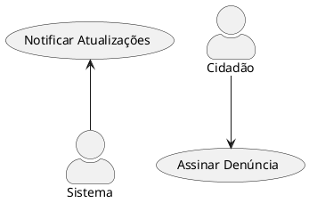
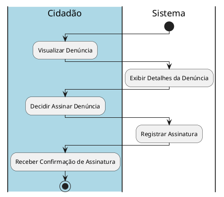

# 1. 🎯 Caso de Uso: Assinar/Creditar Denúncia
- [1. 🎯 Caso de Uso: Login](#1--caso-de-uso-login)
	- [1.1. Identificação](#11-identificação)
	- [1.2. Visão Geral](#12-visão-geral)
	- [1.3. Fluxo Principal de Eventos](#13-fluxo-principal-de-eventos)
	- [1.4. Fluxos Alternativos](#14-fluxos-alternativos)
		- [1.4.1. a. Credenciais Inválidas](#141-cidadão-já-assinou-a-denúncia)
	- [1.5. Fluxos de Exceção](#15-fluxos-de-exceção)
		- [1.5.1. a. Campos Vazios](#151-falha-de-conexão-com-o-servidor)
	- [1.6. Pré-condições](#16-pré-condições)
	- [1.7. Pós-condições](#17-pós-condições)
	- [1.8. Regras de Negócio](#18-regras-de-negócio)
	- [1.9. Perfis de Usuário](#19-perfis-de-usuário)
- [2. Diagrama de Atividades](#2-diagrama-de-atividades)

## 1.1. Identificação
- **Nome**: Assinar Denúncia  
- **Ator Primário**: Usuário Cidadão  
- **Descrição**: Permite que o cidadão assine uma denúncia, associando-se a ela como apoiador.

---

## 1.2. Visão Geral

## 1.3. Fluxo Principal de Eventos
1. O cidadão visualiza uma denúncia publicada.
2. O cidadão decide assinar a denúncia.
3. O sistema registra a assinatura da denúncia, associando o cidadão a ela.
4. O sistema notifica o cidadão da assinatura bem-sucedida.
---

## 1.4. Fluxos Alternativos

### 1.4.1. a. Cidadão já assinou a denúncia
1. O cidadão tenta assinar uma denúncia que já foi assinada por ele.
2. O sistema exibe a mensagem: `"Você já assinou essa denúncia."`

---

## 1.5. Fluxos de Exceção

### 1.5.1. a. Falha de Conexão com o Servidor
- Se houver falha de comunicação com o servidor:
  - O sistema exibe uma mensagem: `"Erro de conexão. Tente novamente mais tarde."`

---

## 1.6. Pré-condições
- O sistema deve estar online e acessível.
- O cidadão deve ter uma conta previamente cadastrada.
- Deve haver uma denúncia avaliada.

---

## 1.7. Pós-condições
- O sistema registra a assinatura.

---

## 1.8. Regras de Negócio
- Um cidadão pode assinar várias denúncias, mas não pode assinar a mesma denúncia mais de uma vez.
  
---

## 1.9. Perfis de Usuário
| Perfil            | Descrição                                                 | Acesso ao sistema     |
| ----------------- | --------------------------------------------------------- | --------------------- |
| **Usuário Cidadão** | Usuário responsável por realizar denúncias. | Painel do usuário     |

---

# 2. Diagrama de Atividades

