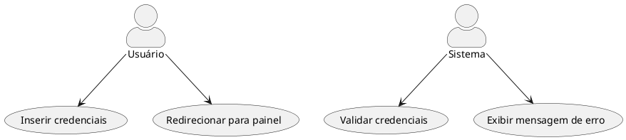
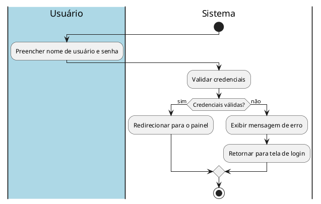

# 1. 🎯 Caso de Uso: Autenticação
- [1. 🎯 Caso de Uso: Login](#1--caso-de-uso-login)
	- [1.1. Identificação](#11-identificação)
	- [1.2. Visão Geral](#12-visão-geral)
	- [1.3. Fluxo Principal de Eventos](#13-fluxo-principal-de-eventos)
	- [1.4. Fluxos Alternativos](#14-fluxos-alternativos)
		- [1.4.1. a. Credenciais Inválidas](#141-a-credenciais-inválidas)
	- [1.5. Fluxos de Exceção](#15-fluxos-de-exceção)
		- [1.5.1. a. Campos Vazios](#151-a-campos-vazios)
		- [1.5.2. b. Falha de Conexão com o Servidor](#152-b-falha-de-conexão-com-o-servidor)
	- [1.6. Pré-condições](#16-pré-condições)
	- [1.7. Pós-condições](#17-pós-condições)
	- [1.8. Regras de Negócio](#18-regras-de-negócio)
	- [1.9. Perfis de Usuário](#19-perfis-de-usuário)
- [2. Diagrama de Atividades](#2-diagrama-de-atividades)

## 1.1. Identificação
- **Nome**: Autenticar Usuário  
- **Ator Primário**: Cidadão  
- **Descrição**: Permite que o cidadão se autentique no sistema com o gov.br.

---

## 1.2. Visão Geral

## 1.3. Fluxo Principal de Eventos
1. O cidadão acessa a página de login.
2. O sistema solicita o cpf do usuário e senha.
3. O usuário insere suas credenciais.
4. O sistema valida as credenciais fornecidas.
5. Se válidas, o cidadão é redirecionado para a página principal.
---

## 1.4. Fluxos Alternativos

### 1.4.1. a. Credenciais Inválidas
1. O sistema detecta que as credenciais são inválidas.
2. O sistema exibe uma mensagem de erro.

---

## 1.5. Fluxos de Exceção

### 1.5.1. a. Campos Vazios
- Se o cidadão deixar campos em branco:
  - O sistema exibe uma mensagem: `"Preencha todos os campos obrigatórios."`

### 1.5.2. b. Falha de Conexão com o Servidor
- Se houver falha de comunicação com o servidor de autenticação:
  - O sistema exibe uma mensagem: `"Erro de conexão. Tente novamente mais tarde."`

---

## 1.6. Pré-condições
- O sistema deve estar online e acessível.
- O cidadão deve ter uma conta previamente cadastrada.

---

## 1.7. Pós-condições
- O cidadão está autenticado e pode acessar suas funcionalidades.

---

## 1.8. Regras de Negócio
- Credenciais para a autenticaçãop devem estar de acordo com as regras do gov.br:
- Para ser cadastrado, o usuário necessita possuir um cpf único e válido.
- A autenticação define o perfil de acesso do usuário.

---

## 1.9. Perfis de Usuário
| Perfil            | Descrição                                                 | Acesso ao sistema     |
| ----------------- | --------------------------------------------------------- | --------------------- |
| **Usuário Cidadão** | Usuário responsável por realizar denúncias. | Painel de autenticação do usuário     |
| **Inativo**       | Usuário desativado ou bloqueado pelo administrador.       | Acesso negado         |

---

# 2. Diagrama de Atividades

