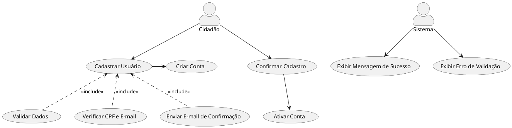
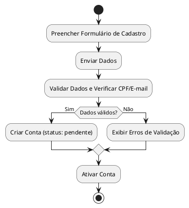

# 1. 🎯 Caso de Uso: Cadastrar Usuário
- [1. 🎯 Caso de Uso: Reclama.se](#1--caso-de-uso-reclama.se)
	- [1.1. Identificação](#11-identificação)
	- [1.2. Visão Geral](#12-visão-geral)
	- [1.3. Fluxo Principal de Eventos](#13-fluxo-principal-de-eventos)
	- [1.4. Fluxos Alternativos](#14-fluxos-alternativos)
		- [1.4.1. a. Dados parcialmente preenchidos](#141-a-dados-parcialmente-preenchidos)
	- [1.5. Fluxos de Exceção](#15-fluxos-de-exceção)
		- [1.5.1. a. CPF já cadastrado](#151-a-cpf-já-cadastrado)
		- [1.5.2. b. Erro no servidor](#152-b-erro-no-servidor)
	- [1.6. Pré-condições](#16-pré-condições)
	- [1.7. Pós-condições](#17-pós-condições)
	- [1.8. Regras de Negócio](#18-regras-de-negócio)
	- [1.9. Perfis de Usuário](#19-perfis-de-usuário)
- [2. Diagrama de Atividades](#2-diagrama-de-atividades)

## 1.1. Identificação
- **Nome**: Cadastrar Usuário  
- **Ator Primário**: Cidadão  
- **Descrição**: Permite a criação de uma nova conta de acesso ao sistema Reclama.se. 

---

## 1.2. Visão Geral

---

## 1.2. Visão Geral

## 1.3. Fluxo Principal de Eventos
1. O cidadão acessa a funcionalidade "Cadastrar-se" na tela inicial do sistema.
2. O sistema apresenta um formulário com os seguintes campos obrigatórios:
3. O cidadão preenche os dados e submete o formulário.
4. O sistema notifica o usuário sobre a ativação da conta e redireciona para o login.
---

## 1.4. Dados parcialmente preenchidos

### 1.4.1. a. Credenciais Inválidas
1. O cidadão tenta enviar o formulário sem preencher todos os campos obrigatórios.
2. O sistema sinaliza os campos ausentes com mensagens de validação.
3. O fluxo retorna para a etapa de preenchimento.

---

## 1.5. Fluxos de Exceção

### 1.5.1. a. CPF já cadastrado
- O cidadão preenche o formulário com um CPF que já está associado a outra conta.
- O sistema exibe uma mensagem: `"Preencha todos os campos obrigatórios."`

### 1.5.2. b. Erro no Servidor
- Se houver falha de comunicação com o servidor na execução:
  - O sistema exibe uma mensagem: `"Erro de conexão. Tente novamente mais tarde."`

---

## 1.6. Pré-condições
- O sistema deve estar online e acessível.
- O sistema deve estar acessível via internet.
- O cidadão deve possuir um CPF válido.

---

## 1.7. Pós-condições
- Uma nova conta de usuário foi registrada no sistema.
- O cidadão está apto a acessar o sistema.

---

## 1.8. Regras de Negócio
- Para ser cadastrado, o usuário necessita possuir um cpf único e válido.
- A autenticação define o perfil de acesso do usuário.

---

## 1.9. Perfis de Usuário
| Perfil            | Descrição                                                 | Acesso ao sistema     |
| ----------------- | --------------------------------------------------------- | --------------------- |
| **Usuário Cidadão** | Usuário responsável por realizar denúncias. | Painel de cadastro do usuário     |
| **Inativo**       | Usuário desativado ou bloqueado pelo administrador.       | Acesso negado         |

---

# 2. Diagrama de Atividades

