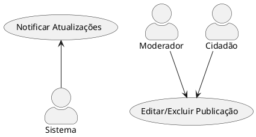

# 1. 🎯 Caso de Uso: Pesquisar Denúncia
- [1. 🎯 Caso de Uso: Reclama.se](#1--caso-de-uso-reclama.se)
	- [1.1. Identificação](#11-identificação)
	- [1.2. Visão Geral](#12-visão-geral)
	- [1.3. Fluxo Principal de Eventos](#13-fluxo-principal-de-eventos)
	- [1.4. Fluxos Alternativos](#14-fluxos-alternativos)
		- [1.4.1. a. Credenciais Inválidas](#141-nenhum-resultado-encontrado)
	- [1.5. Fluxos de Exceção](#15-fluxos-de-exceção)
		- [1.5.1. a. Falha de Conexão com o Servidor](#151-b-falha-na-conexão-com-a-base-de-dados)
	- [1.6. Pré-condições](#16-pré-condições)
	- [1.7. Pós-condições](#17-pós-condições)
	- [1.8. Regras de Negócio](#18-regras-de-negócio)
	- [1.9. Perfis de Usuário](#19-perfis-de-usuário)
- [2. Diagrama de Atividades](#2-diagrama-de-atividades)

## 1.1. Identificação
- **Nome**: Pesquisar Denúncia  
- **Ator Primário**: Cidadão; Moderador; Entidade (Órgão)
- **Descrição**:Permite pesquisas por denúncias registradas no sistema.
---

## 1.2. Visão Geral

## 1.3. Fluxo Principal de Eventos
1. O usuário ou moderador acessa a página de pesquisa de denúncias.
2. O sistema apresenta uma caixa de pesquisa e filtros de pesquisa, como:
	- Título da denúncia.
	- Status da denúncia.
  	- Data da denúncia
	- Entidade (Órgão)
3. O usuário insere os critérios de pesquisa desejados.
4. O sistema retorna a consulta realizada. 
---

## 1.4. Fluxos Alternativos

### 1.4.1. a. Nenhum Resultado Encontrado
1. O sistema detecta que não há denúncias correspondentes aos critérios de pesquisa.
2. O sistema exibe a mensagem: `"Nenhum resultado encontrado."`

---

## 1.5. Fluxos de Exceção

### 1.5.1. a. Falha na Conexão com a Base de Dados
- Se ocorrer uma falha de conexão:
  - O sistema exibe a mensagem: `"Erro de conexão. Tente novamente mais tarde."`
    
---

## 1.6. Pré-condições
- O sistema deve estar online e acessível.
- O usuário deve estar autenticado.
- O usuário deve ter permissões adequadas para acessar a pesquisa de denúncias.

---

## 1.7. Pós-condições
- O usuário ou moderador visualiza os resultados da pesquisa.
- Caso existam denúncias correspondentes, o usuário pode visualizar os detalhes de cada uma.

---

## 1.8. Regras de Negócio
- A pesquisa deve ser realizada com base nos filtros disponíveis (título, status, data).
- O sistema deve garantir que apenas denúncias positivamente avaliadas e/ou acessíveis ao usuário sejam exibidas.
  
---

## 1.9. Perfis de Usuário
| Perfil             | Descrição                                                                                   | Acesso ao sistema             |
| ------------------ | ------------------------------------------------------------------------------------------- | ----------------------------- |
| **Órgão/Entidade** | Representante de órgão público ou privado responsável pela resolução das denúncias.         | Painel administrativo         |
| **Usuário comum**  | Cidadão comum, podendo registrar suas próprias denúncias, e dar feedback sobre as soluções. | Painel do usuário             |
| **Moderador**      | Usuário com permissões de moderação, incluindo editar ou excluir denúncias.                 | Painel do usuário/funcionário |

---

# 2. Diagrama de Atividades

```plantuml
@startuml

|#lightblue|Usuário|

|Sistema|
start

|Usuário|
:Iniciar pesquisa de denúncia; <<procedure>>
|Sistema|
:Exibir caixa de pesquisa e filtros;

|Usuário|
:Preencher filtros de pesquisa; <<input>>
|Sistema|
:Processar consulta de denúncia; <<procedure>>

|Usuário|
:Exibir resultados de pesquisa; <<output>>

if (Resultados encontrados?) then (sim)
  :Exibir detalhes da denúncia selecionada;
else (não)
  :Exibir mensagem "Nenhum resultado encontrado";
endif

stop

@enduml
```

