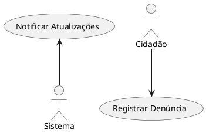
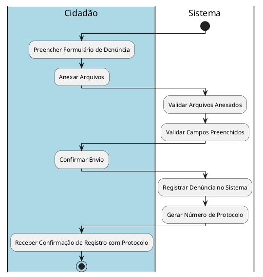

# 1. 🎯 Caso de Uso: Registrar Denúncia
- [1. 🎯 Caso de Uso: Reclama.se](#1--caso-de-uso-reclama.se)
	- [1.1. Identificação](#11-identificação)
	- [1.2. Visão Geral](#12-visão-geral)
	- [1.3. Fluxo Principal de Eventos](#13-fluxo-principal-de-eventos)
	- [1.4. Fluxos Alternativos](#14-fluxos-alternativos)
		- [1.4.1. a. Arquivos adicionados não compatíveis](#141-a-arquivos-adicionados-não-compatíveis)
		- [1.4.2. b. Mensagens sem conformidade com as diretrizes](#142-b-mensagens-sem-conformidade-com-as-diretrizes)
	- [1.5. Fluxos de Exceção](#15-fluxos-de-exceção)
		- [1.5.1. a. Campos Vazios](#151-a-campos-vazios)
		- [1.5.2. b. Arquivo Anexado Incompatível](#152-b-arquivo-anexado-incompatível)
	- [1.6. Pré-condições](#16-pré-condições)
	- [1.7. Pós-condições](#17-pós-condições)
	- [1.8. Regras de Negócio](#18-regras-de-negócio)
	- [1.9. Perfis de Usuário](#19-perfis-de-usuário)
- [2. Diagrama de Atividades](#2-diagrama-de-atividades)

## 1.1. Identificação
- **Nome**: Registro de Denúncia  
- **Ator Primário**: Usuário Cidadão
- **Descrição**: O usuário aponta um problema público, mediante uma denúncia, acionando os órgãos responsáveis, a fim de sua resolução. 
---

## 1.2. Visão Geral

## 1.3. Fluxo Principal de Eventos
1. O usuário realiza uma denúncia, apontando um problema público.
2. O sistema solicita o anexo de arquivos (evidências).
3. O cidadão preenche os campos obrigatórios e anexa arquivos, se necessário.
4. O sistema valida os dados inseridos e a compatibilidade dos arquivos anexados.
5. O sistema registra a denúncia e gera um número de protocolo
6. O sistema envia uma notificação de confirmação ao cidadão com o número da denúncia.

---

## 1.4. Fluxos Alternativos

### 1.4.1. a. Arquivos adicionados não compatíveis
1. O sistema detecta que os arquivos anexados não são compatíveis.
2. O sistema notifica o usuário sobre o ocorrido automaticamente.
3. O sistema solicita novos arquivos.
4. Caso os novos arquivos estejam corretos, segue para fluxo principal.

### 1.4.2. b. Mensagens sem conformidade com as diretrizes
1. O usuário envia sua mensagem (denúncia ou feedback).
2. Os moderadores do sistema realizam a análise da mensagem.
3. Caso elas estajem de acordo com as diretrizes, a mensagem é publicada normalmente.
4. Caso não esteja de acordo com as diretrizes, o moderador realiza a edição ou exclusão da mensagem.

---

## 1.5. Fluxos de Exceção

### 1.5.1. a. Campos Vazios
- Se o usuário tentar enviar a denúncia com campos obrigatórios em branco:
  - O sistema exibe uma mensagem: `"Preencha todos os campos obrigatórios."`
  - O fluxo retorna para a etapa de preenchimento do formulário de denúncia.

### 1.5.2. b. Arquivo Anexado Incompatível
- Se o usuário anexar um arquivo que não seja compatível:
  - O sistema exibe uma mensagem: `"O arquivo anexado não é compatível. Por favor, anexe um arquivo em um dos seguintes formatos: .pdf, .png, .jpg, .docx, .mp4."`
  - O fluxo retorna para a etapa de anexação de arquivos.
    
---

## 1.6. Pré-condições
- O sistema deve estar online e acessível.
- O usuário deve possuir uma conta previamente registrada com um cpf único.
- O usuário deve estar autenticado para realizar qualquer ação no sistema.
- O sistema deve ter a funcionalidade de notificar o usuário sobre o status de sua denúncia (notificação habilitada).

---

## 1.7. Pós-condições
- O usuário está autenticado no sistema.
- O acesso às funcionalidades está liberado conforme o perfil do usuário.
- A denúncia foi registrada com sucesso no sistema, gerando um número de protocolo.
- O sistema enviou um relatório da denúncia ao órgão responsável.
  
---

## 1.8. Regras de Negócio
- Todos os campos obrigatórios da denúncia devem ser preenchidos.
- O sistema deve validar a compatibilidade dos arquivos anexados.
- A mensagem deve ser avaliada para estar em conformidade com as diretrizes.
- O cidadão deve receber uma confirmação com número de protocolo após registrar a denúncia.
  
---

## 1.9. Perfis de Usuário
| Perfil             | Descrição                                                                                   | Acesso ao sistema             |
| ------------------ | ------------------------------------------------------------------------------------------- | ----------------------------- |
| **Órgão/Entidade** | Representante de órgão público ou privado responsável pela resolução das denúncias.         | Painel administrativo         |
| **Usuário comum**  | Cidadão comum, podendo registrar suas próprias denúncias, e dar feedback sobre as soluções. | Painel do usuário             |
| **Moderador**      | Usuário com permissões de moderação, incluindo editar ou excluir denúncias.                 | Painel do usuário/funcionário |
| **Inativo**        | Usuário desativado ou bloqueado pelo administrador.                                         | Acesso negado                 |

---

# 2. Diagrama de Atividades

