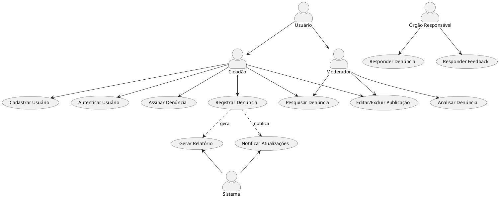
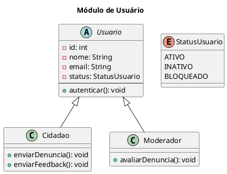

# 📊 Diagramas UML do Sistema

## Visão Geral do Sistema

> Adicionar o diagrama de caso de uso que mostra a visão geral do sistema

## Casos de Uso

>  Para cada item, apresentar: Nome, Atores, Fluxo principal, Fluxo alternativo, Pré-condições e Pós-condições, etc. 

| Nome                                   | Descrição breve                                               | Observações                        |
| -------------------------------------- | ------------------------------------------------------------- | ---------------------------------- |
| [Registrar Denúncia](./UC_Denuncia.md) | Permite ao usuário realizar uma denúncia pública              | Realizado por um usuário cidadão  |
| [Cadastrar Usuário](./UC_Denuncia.md)  | Permite ao usuário se cadastrar ao sistema                    | Realizado pelo usuário, permitido pelo sistema |
| [Autenticar Usuário](./UC_Denuncia.md) | Permite ao usuário realizar a autenticação                    | Autenticação realizada pelo usuário com o gov.br |
| [Assinar Denúncia](./UC_Denuncia.md)   | Permite ao cidadão assinar/creditar uma denúncia existente    | Realizado por qualquer cidadão |
| [Pesquisar Denúncia](./UC_Denuncia.md) | Permite a pesquisa de denúncias já registradas                | Disponível para Cidadão, Moderador |
| [Editar/Excluir Publicação](./UC_Denuncia.md) | Permite ao usuário editar ou excluir uma denúncia ou publicação | Realizado por Moderador ou Cidadão (conforme permissões) |
| [Analisar Denúncia](./UC_Denuncia.md)  | Permite ao Moderador analisar uma denúncia registrada         | Realizado por Moderador |
| [Responder Denúncia](./UC_Denuncia.md) | Permite ao órgão responsável responder a uma denúncia         | Realizado pelo Órgão Responsável |
| [Responder Feedback](./UC_Denuncia.md) | Permite ao órgão responsável responder ao feedback da denúncia | Realizado pelo Órgão Responsável |
| [Notificar Atualizações](./UC_Denuncia.md) | Notifica o usuário sobre atualizações em denúncias         | Realizado pelo Sistema |
| [Gerar Relatório](./UC_Denuncia.md)    | Permite ao sistema gerar relatórios sobre o estado das denúncias | Realizado pelo Sistema |

## 🔹 Diagrama de Classes

### Módulo de Usuário

## 🔹 Diagrama de Estados

> Mostra os estados possíveis de cada entidade [ex: login] e as transições entre eles.

| Nome                                       | Finalidade / Obs                            |
| ------------------------------------------ | ------------------------------------------- |
| [Status da Denúncia](./DE_denuncia.puml)    | Criada → Avaliada → Respondida → Finalizada |
| [Status do Feedback](./DE_feedback.puml)    | Enviado → Visualizado → Encerrado           |
| [Status do Usuário](./DE_usuario.puml)      | Ativo, Inativo, Bloqueado                   |
| [Status da Avaliação](./DE_avaliacao.puml)  | Pendente → Avaliada                         |
| [Status do Arquivo](./DE_arquivo.puml)      | Adicionado → Validando → Aceito ou Recusado |

