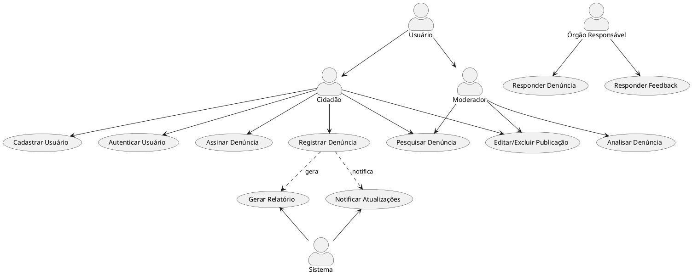
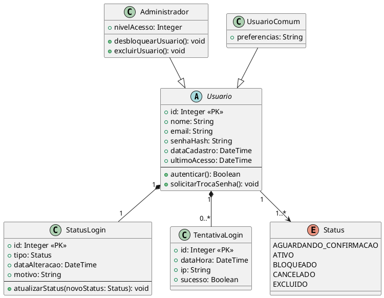

# 📊 Diagramas UML do Sistema

## Visão Geral do Sistema

> Adicionar o diagrama de caso de uso que mostra a visão geral do sistema

## Casos de Uso

>  Para cada item, apresentar: Nome, Atores, Fluxo principal, Fluxo alternativo, Pré-condições e Pós-condições, etc. 

| Nome                                   | Descrição breve                                               | Observações                     |
| -------------------------------------- | ------------------------------------------------------------- | ------------------------------- |
| [Registrar Denúncia](./UC_Denuncia.md) | Permite ao usuário realizar uma denúncia pública              |                                 |
| A2                                     | B2                                                            | C2                              |
| A3                                     | B3                                                            | C3                              |

## 🔹 Diagrama de Classes

### Módulo de Usuário

## 🔹 Diagrama de Estados

> Mostra os estados possíveis de cada entidade [ex: login] e as transições entre eles.

| Nome                            | Finalidade / Obs  |
| ------------------------------- | ----------------- |
| [Status Usuário](./DE_login.md) | Status do usuário |
| A2                              | B2                |
| A3                              | B3                |

