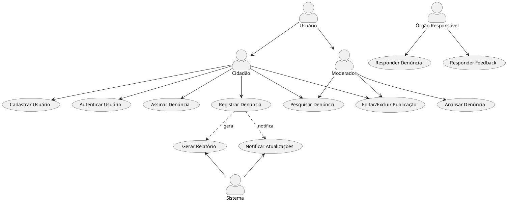
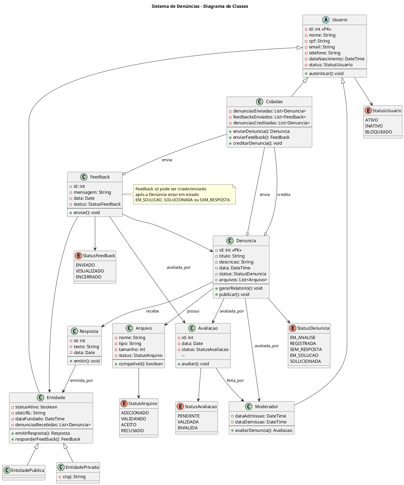

# 📊 Diagramas UML do Sistema

## Visão Geral do Sistema

> Adicionar o diagrama de caso de uso que mostra a visão geral do sistema

```puml
@startuml

skinparam actorStyle awesome

actor "Usuário" as U
actor "Órgão Responsável" as O
actor "Sistema" as S
actor "Moderador" as M
actor "Cidadão" as C

U --> C
U --> M

C --> (Cadastrar Usuário)
C --> (Autenticar Usuário)
C --> (Registrar Denúncia)
C --> (Assinar Denúncia)
C --> (Pesquisar Denúncia)
C --> (Editar/Excluir Publicação)

M --> (Pesquisar Denúncia)
M --> (Editar/Excluir Publicação)
M --> (Analisar Denúncia)

S -up-> (Notificar Atualizações)
S -up-> (Gerar Relatório)


O --> (Responder Denúncia)
O --> (Responder Feedback)

(Registrar Denúncia) .down.> (Gerar Relatório) : gera
(Registrar Denúncia) .down.> (Notificar Atualizações) : notifica

@enduml
```

## Casos de Uso

>  Para cada item, apresentar: Nome, Atores, Fluxo principal, Fluxo alternativo, Pré-condições e Pós-condições, etc. 

| Nome                                   | Descrição breve                                               | Observações                        |
| -------------------------------------- | ------------------------------------------------------------- | ---------------------------------- |
| [Registrar Denúncia](./UC_Denuncia.md) | Permite ao usuário realizar uma denúncia pública              | Realizado por um usuário cidadão  |
| [Cadastrar Usuário](./UC_Denuncia.md)  | Permite ao usuário se cadastrar ao sistema                    | Realizado pelo usuário, permitido pelo sistema |
| [Autenticar Usuário](./UC_Denuncia.md) | Permite ao usuário realizar a autenticação                    | Autenticação realizada pelo usuário com o gov.br |
| [Assinar Denúncia](./UC_Denuncia.md)   | Permite ao cidadão assinar/creditar uma denúncia existente    | Realizado por qualquer cidadão |
| [Pesquisar Denúncia](./UC_Denuncia.md) | Permite a pesquisa de denúncias já registradas                | Disponível para Cidadão, Moderador |
| [Editar/Excluir Publicação](./UC_Denuncia.md) | Permite ao usuário editar ou excluir uma denúncia ou publicação | Realizado por Moderador ou Cidadão (conforme permissões) |
| [Analisar Denúncia](./UC_Denuncia.md)  | Permite ao Moderador analisar uma denúncia registrada         | Realizado por Moderador |
| [Responder Denúncia](./UC_Denuncia.md) | Permite ao órgão responsável responder a uma denúncia         | Realizado pelo Órgão Responsável |
| [Responder Feedback](./UC_Denuncia.md) | Permite ao órgão responsável responder ao feedback da denúncia | Realizado pelo Órgão Responsável |
| [Notificar Atualizações](./UC_Denuncia.md) | Notifica o usuário sobre atualizações em denúncias         | Realizado pelo Sistema |
| [Gerar Relatório](./UC_Denuncia.md)    | Permite ao sistema gerar relatórios sobre o estado das denúncias | Realizado pelo Sistema |

## 🔹 Diagrama de Classes

### Diagrama Geral do Sistema

```plantuml
@startuml
title Sistema de Denúncias - Diagrama de Classes

abstract class Usuario {
  - id: int <<PK>>
  - nome: String
  - cpf: String
  - email: String
  - telefone: String 
  - dataNascimento: DateTime
  - status: StatusUsuario
  --
  + autenticar(): void
}

class Cidadao extends Usuario {
  - denunciasEnviadas: List<Denuncia> 
  - feedbacksEnviados: List<Feedback>
  - denunciasCreditadas: List<Denuncia>
  --
  + enviarDenuncia(): Denuncia
  + enviarFeedback(): Feedback
  + creditarDenuncia(): void
}

class Moderador extends Usuario {
  - dataAdmissao: DateTime
  - dataDemissao: DateTime
  --
  + avaliarDenuncia(): Avaliacao
}

class Entidade extends Usuario {
  - statusAtivo: boolean 
  - siteURL: String 
  - dataFundado: DateTime
  - denunciasRecebidas: List<Denuncia>
  --
  + emitirResposta(): Resposta
  + responderFeedback(): Feedback
}

class EntidadePublica extends Entidade {
}

class EntidadePrivada extends Entidade {
  - cnpj: String
}

class Denuncia {
  - id: int <<PK>>
  - titulo: String
  - descricao: String
  - data: DateTime
  - status: StatusDenuncia
  - arquivos: List<Arquivo>
  --
  + gerarRelatorio(): void
  + publicar(): void
}

class Arquivo {
  - nome: String
  - tipo: String
  - tamanho: int
  - status: StatusArquivo
  --
  + compativel(): boolean
}

class Avaliacao {
  - id: int
  - data: Date
  - status: StatusAvaliacao
  -- 
  + avaliar(): void
}

class Resposta {
  - id: int
  - texto: String
  - data: Date
  --
  + emitir(): void
}

class Feedback {
  - id: int
  - mensagem: String
  - data: Date
  - status: StatusFeedback
  --
  + enviar(): void
}

' Enums
enum StatusUsuario {
  ATIVO
  INATIVO
  BLOQUEADO
}

enum StatusDenuncia {
  EM_ANALISE
  REGISTRADA
  SEM_RESPOSTA
  EM_SOLUCAO
  SOLUCIONADA
}

enum StatusArquivo {
  ADICIONADO
  VALIDANDO
  ACEITO
  RECUSADO
}

enum StatusAvaliacao {
  PENDENTE
  VALIDADA
  INVALIDA
}

enum StatusFeedback {
  ENVIADO
  VISUALIZADO
  ENCERRADO
}

' Relacionamentos
Cidadao --o Denuncia : envia
Cidadao --o Feedback : envia
Cidadao --o Denuncia : credita
Denuncia --> Arquivo : possui
Denuncia --> Resposta : recebe
Denuncia --> Moderador : avaliada_por
Denuncia --> Avaliacao : avaliada_por
Feedback --> Avaliacao : avaliada_por
Avaliacao --> Moderador : feita_por
Resposta --> Entidade : emitida_por
Feedback --> Denuncia
Feedback --> Entidade

Usuario --> StatusUsuario
Denuncia --> StatusDenuncia
Arquivo --> StatusArquivo
Avaliacao --> StatusAvaliacao
Feedback --> StatusFeedback

' Nota
note right of Feedback
  Feedback só pode ser criado/enviado
  após a Denúncia estar em estado
  EM_SOLUCAO, SOLUCIONADA ou SEM_RESPOSTA.
end note
@enduml
```

## 🔹 Diagrama de Estados

> Mostra os estados possíveis de cada entidade [ex: login] e as transições entre eles.

| Nome                                       | Finalidade / Obs                                                   |
| ------------------------------------------ | -------------------------------------------------------------------|
| [Status da Denúncia](./DE_denuncia.puml)    | REGISTRADA → EM_ANALISE → EM_SOLUCAO / SEM_RESPOSTA → SOLUCIONADA |
| [Status do Feedback](./DE_feedback.puml)    | ENVIADO → VISUALIZADO → ENCERRADO                                 |
| [Status do Usuário](./DE_usuario.puml)      | ATIVO → INATIVO → BLOQUEADO                                       |
| [Status da Avaliação](./DE_avaliacao.puml)  | PENDENTE → VALIDADA ou INVALIDA                                   |
| [Status do Arquivo](./DE_arquivo.puml)      | ADICIONADO → VALIDANDO → ACEITO ou RECUSADO                       |

