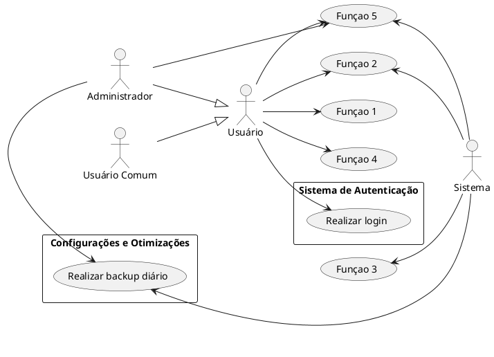
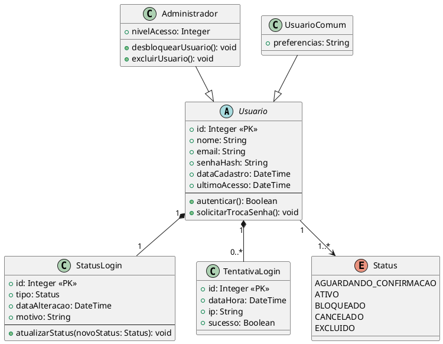

# 📊 Diagramas UML do Sistema

## Visão Geral do Sistema

> Adicionar o diagrama de caso de uso que mostra a visão geral do sistema

```puml
@startuml

left to right direction


actor "Usuário" as Usuario
actor "Administrador" as Adm
actor "Usuário Comum" as Comum
actor Sistema as Sistema


Adm --|> Usuario
Comum --|> Usuario


rectangle "Sistema de Autenticação" {
  usecase "Realizar login" as UC1
}

rectangle "Configurações e Otimizações" {
  usecase "Realizar backup diário" as UCS1
}
usecase "Funçao 1" as UCEx1
usecase "Funçao 2" as UCEx2
usecase "Funçao 3" as UCEx3
usecase "Funçao 4" as UCEx4
usecase "Funçao 5" as UCEx5

Usuario --> UC1
Usuario --> UCEx1
Usuario --> UCEx2
Usuario --> UCEx4
Usuario --> UCEx5
Sistema -up-> UCS1
Sistema -up-> UCEx3
Sistema -up-> UCEx2
Sistema -up-> UCEx5

Adm -> UCS1
Adm -> UCEx5
@enduml

```

## Casos de Uso

>  Para cada item, apresentar: Nome, Atores, Fluxo principal, Fluxo alternativo, Pré-condições e Pós-condições, etc. 

| Nome                               | Descrição breve             | Observações |
| ---------------------------------- | --------------------------- | ----------- |
| [Realizar Login](./UC_01_login.md) | Permite o acesso ao sistema | -           |
| A2                                 | B2                          | C2          |
| A3                                 | B3                          | C3          |

## 🔹 Diagrama de Classes

### Módulo de Usuário

```plantuml
@startuml
skinparam groupInheritance 2
abstract class Usuario {
  + id: Integer <<PK>>
  + nome: String
  + email: String
  + senhaHash: String
  + dataCadastro: DateTime
  + ultimoAcesso: DateTime
  --
  + autenticar(): Boolean
  + solicitarTrocaSenha(): void
}

class Administrador {
  + nivelAcesso: Integer
  + desbloquearUsuario(): void
  + excluirUsuario(): void
}

class UsuarioComum {
  + preferencias: String
}

class StatusLogin{
  + id: Integer <<PK>>
  + tipo: Status
  + dataAlteracao: DateTime
  + motivo: String
  --
  + atualizarStatus(novoStatus: Status): void
}

class TentativaLogin {
  + id: Integer <<PK>>
  + dataHora: DateTime
  + ip: String
  + sucesso: Boolean
}

Usuario "1" *-- "1" StatusLogin
Usuario "1" *-- "0..*" TentativaLogin

Administrador --|> Usuario
UsuarioComum --|> Usuario

enum Status {
  AGUARDANDO_CONFIRMACAO
  ATIVO
  BLOQUEADO
  CANCELADO
  EXCLUIDO
}

Usuario "1" --> "1..*" Status

@enduml
```

## 🔹 Diagrama de Estados

> Mostra os estados possíveis de cada entidade [ex: login] e as transições entre eles.

| Nome                            | Finalidade / Obs  |
| ------------------------------- | ----------------- |
| [Status Usuário](./DE_login.md) | Status do usuário |
| A2                              | B2                |
| A3                              | B3                |

