# 📊 Diagramas UML do Sistema

## Visão Geral do Sistema

> Adicionar o diagrama de caso de uso que mostra a visão geral do sistema

## Casos de Uso

>  Para cada item, apresentar: Nome, Atores, Fluxo principal, Fluxo alternativo, Pré-condições e Pós-condições, etc. 

| Nome                               | Descrição breve             | Observações |
| ---------------------------------- | --------------------------- | ----------- |
| [Realizar Login](./UC_01_login.md) | Permite o acesso ao sistema | -           |
| A2                                 | B2                          | C2          |
| A3                                 | B3                          | C3          |

## 🔹 Diagrama de Classes

### Módulo de Usuário

```plantuml
@startuml
title Módulo de Usuário

abstract class Usuario {
  - id: int
  - nome: String
  - email: String
  - status: StatusUsuario
  --
  + autenticar(): void
}

class Cidadao extends Usuario {
  + enviarDenuncia(): void
  + enviarFeedback(): void
}

class Moderador extends Usuario {
  + avaliarDenuncia(): void
}


enum StatusUsuario {
  ATIVO
  INATIVO
  BLOQUEADO
}
@enduml
```

## 🔹 Diagrama de Estados

> Mostra os estados possíveis de cada entidade [ex: login] e as transições entre eles.

| Nome                                       | Finalidade / Obs                            |
| ------------------------------------------ | ------------------------------------------- |
| [Status da Denúncia](./DE_denuncia.puml)    | Criada → Avaliada → Respondida → Finalizada |
| [Status do Feedback](./DE_feedback.puml)    | Enviado → Visualizado → Encerrado           |
| [Status do Usuário](./DE_usuario.puml)      | Ativo, Inativo, Bloqueado                   |
| [Status da Avaliação](./DE_avaliacao.puml)  | Pendente → Avaliada                         |
| [Status do Arquivo](./DE_arquivo.puml)      | Adicionado → Validando → Aceito ou Recusado |

